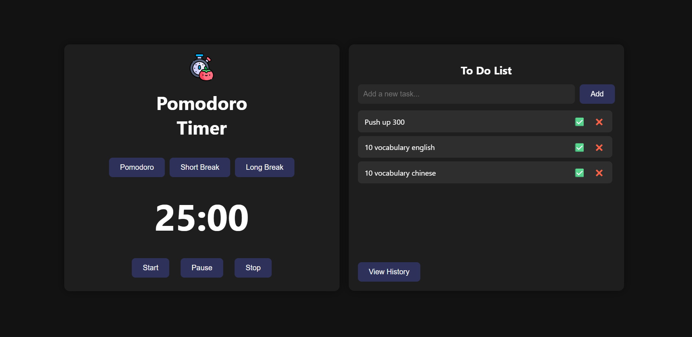

# 🍅 Pomodoro Timer Web App

A clean, responsive Pomodoro Timer built with **HTML**, **CSS**, and **JavaScript**.  
Stay focused and productive by using the **Pomodoro Technique** — a time management method that breaks work into intervals (typically 25 minutes) followed by short breaks.

---

## 🚀 Features

- 🕒 Pomodoro (25 mins), Short Break (5 mins), Long Break (10 mins)
- ✅ Start / Pause / Stop timer controls
- 🔔 Sound notification when the timer ends
- 🖥️ Clean, modern, and responsive UI
- 💡 Fully offline-capable, no external libraries required
- 📝 Built-in To-Do List with history tracking and animated flip card

---

## 🖼️ Preview

---

## 💡 How to Use

1. Open `index.html` directly in your browser _(or use a local server)_.
2. Select a session type: **Pomodoro**, **Short Break**, or **Long Break**.
3. Click **Start** to begin the countdown.
4. Use **Pause** to stop temporarily and **Resume** to continue.
5. Click **Stop** to reset the timer.
6. Use the **To-Do List** to manage tasks. Mark tasks as complete ✅ or delete 🗑️.
7. Flip the card to view completed task history.

---

## 🧠 Why Use Pomodoro?

- Boosts focus and concentration
- Reduces burnout and fatigue
- Creates a sustainable work rhythm

---

## 📬 Contact

Developed by **ngocthach752@gmail.com**  
Built with love, focus, and simplicity. Inspired by real productivity needs.

---

⭐ _Contributions and suggestions are welcome!_
